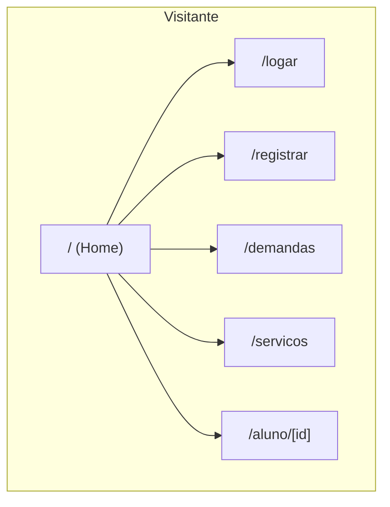

# Protótipos de Interface com o Usuário

## Mapa do Site

```mermaid
flowchart TD
   subgraph Visitante
        A["/ (Home)"]
        A --> C["/logar"]
        A --> D["/registrar"]
        A --> B["/demandas"]
        A --> E["/servicos"]
        A --> F["/aluno/[id]"]
    end
```
